# SFT vs GRPO Training Pipelines

## Comparison Overview

```mermaid
flowchart LR
    subgraph A["SFT Pipeline (train_flat.py)"]
        A1["Load config<br/>cfg=flat.yaml"] --> A2["Init tokenizer + base LM"]
        A2 --> A3["Apply single LoRA adapter"]
        A3 --> A4["Load GSM8K train split"]
        A4 --> A5["Build prompt: 'Question: ... Reasoning:'"]
        A5 --> A6["Append gold answer (after ####)"]
        A6 --> A7["Tokenize + labels = input_ids<br/>max_length=256, padding"]
        A7 --> A8["Heuristic reward label per sample<br/>1.0 if numeric answer present else 0.0"]
        A8 --> A9["RewardWeightedTrainer (custom Trainer)<br/>loss = mean(token CE * reward)"]
        A9 --> A10["Trainer train loop + optimizer"]
        A10 --> A11["Save checkpoint(s) + final model"]
        A11 --> A12["W&B log"]
    end

    subgraph B["GRPO Router–Solver Pipeline (train_router_solver.py)"]
        B1["Load config<br/>cfg=router_solver.yaml"] --> B2["Init base LM + 2 LoRA adapters"]
        B2 --> B3["Load GSM8K train split<br/>optional slim: first len/8"]
        B3 --> B4["Parse numeric ground-truth answers"]
        B4 --> B5["Each step: sample B questions"]
        B5 --> B6["Rollout B×G trajectories<br/>via batched_rollout"]
        B6 --> B7["For each question: Router outputs plan + Solver executes tools"]
        B7 --> B8["Compute rewards:<br/>router_reward + solver_step_reward OR shared outcome reward"]
        B8 --> B9["Group-normalize advantages per question (GRPO)"]
        B9 --> B10["Batched teacher-forced logprobs<br/>for router + solver"]
        B10 --> B11["GRPO loss + KL penalty vs disabled-LoRA reference"]
        B11 --> B12["Backward (optional chunking/OOM-safe fallback) + AdamW"]
        B12 --> B13["Metrics: outcome_acc/router_r/solver_r/invalid_plans<br/>+ optional parity check + checkpoints"]
        B13 --> B14["Save final hierarchical model"]
        B14 --> B15["W&B log"]
    end

    A12 --> C["Model artifacts"]
    B15 --> C
```

## Key pipeline difference

- **SFT pipeline** uses supervised-style token prediction with fixed weighted cross-entropy targets.
- **GRPO pipeline** uses sequential rollouts plus advantage-weighted policy-gradient updates, with separate router and solver token streams and optional KL regularization.

## Shared components

- Same underlying model family (`Qwen2.5-1.5B-Instruct` path in this repo).
- Both pipelines use LoRA adapters and tokenization via Hugging Face `AutoTokenizer`.
- Both log to W&B when `WANDB_API_KEY` is set.

