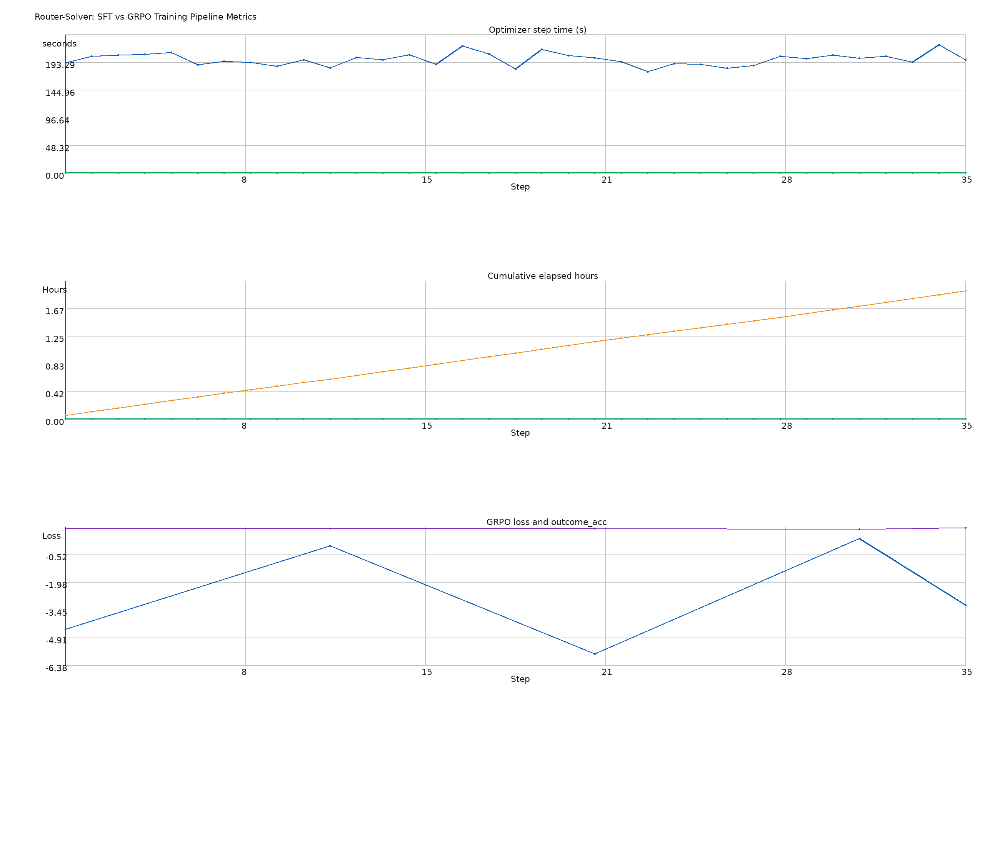

# SFT vs GRPO Training Pipeline Metrics

This document is generated from real training runs (no Mermaid diagram).

### Data provenance used for the chart

- SFT log: `router_solver/logs/flat_baseline_training.log`
- GRPO log: `router_solver/logs/final_fullpass_B120_G2_steps35.out`

### How to regenerate

```bash
cd /home/pvd2112/rl_final_project/router_solver
python scripts/plot_training_pipeline_charts.py \
  --sft-log logs/flat_baseline_training.log \
  --grpo-log logs/final_fullpass_B120_G2_steps35.out \
  --out-dir docs/assets \
  --csv \
  --png
```

Outputs:

- `router_solver/docs/assets/training_pipeline_chart.html`
- `router_solver/docs/assets/training_pipeline_data.csv`
- `router_solver/docs/assets/training_pipeline_chart.png`

### Included chart



### Chart

- Open:

```text
file:///home/pvd2112/rl_final_project/router_solver/docs/assets/training_pipeline_chart.html
```

### What it shows

- Optimizer step cost (seconds) for GRPO, plus SFT average from the flat baseline.
- Cumulative elapsed-hours projection/comparison for the same step axis.
- GRPO outcome trajectory from logged checkpoints.
